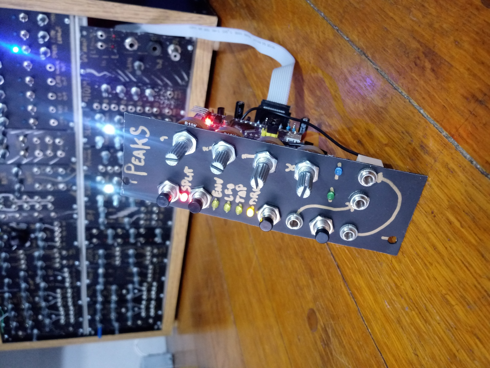

# $peaks, a fully-functional low-cost reversion of [Mutable instrument's Peaks](https://mutable-instruments.net/modules/peaks/)

## Motivation
Where I am from it is sometimes very difficult to source components for digital Eurorack modules, but I had my eyes on Peaks for a long time and I wanted to do something cheap with the same functionality. The basic premise was to use a bluepill (stm32f103c8t6 development board) and omit the DAC IC, relying on a technic called dual PWM as it is described in [openmusiclabs blog](http://www.openmusiclabs.com/learning/digital/pwm-dac/dual-pwm-circuits/index.html) and used, for example, in the popular [Mozzi Library](https://github.com/sensorium/Mozzi) for Arduino.

## Description
The project uses a single sided home-etched PCB with a couple of jumper wires, the potentiometers are regular 16mm ones mounted at the side, also helping with the mechanical stability of the build.  
You will a bluepill capable of 128kb of flash, I bought mine advertised as only having 64kb, but it ended up not being the case, so it's worth the try

## Changes
* Added a driver for the PWM DAC running at **14 bit depth, 48Khz sampling rate.** (File in firmware/peaks/drivers/pwm_dac.h)
* Activated the clock for the TIM4 in firmware/peaks/drivers/system.cc
* **Bypassed the bootloader:** This was done as to simplify the code, it does not interfere with the calibration functionality of the module.
* Redesigned the output portion of the hardware to accommodate to the PWM levels. 

## Flashing and development
To make it easier I have left binaries and .HEX files in firmware/build, this can be flashed directly to the bluepill using [STM32CubeProgrammer](https://www.st.com/en/development-tools/stm32cubeprog.html).  
Another option is to install the [mutable-dev-environment](https://github.com/pichenettes/mutable-dev-environment) and replace the peaks folder with the one inside /firmware, then executing

    make -f peaks/makefile upload_serial

We use this command because the bootloader is bypassed.

## Thanks
I want to thank Emilie Gillet for open-sourcing her work which is a constant inspiration for many musicians and makers, and encourage everyone interested in this project to checkout the [Mutable instrument's Forum](https://forum.mutable-instruments.net/) in which Emilie is a very active member.
